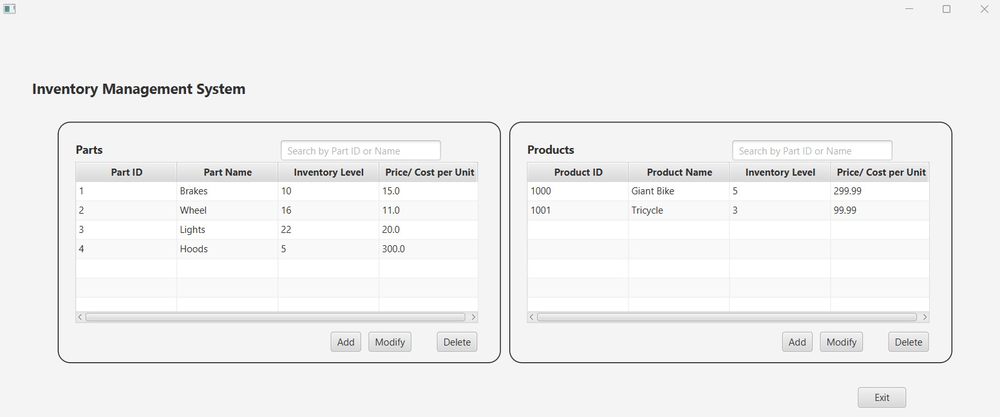
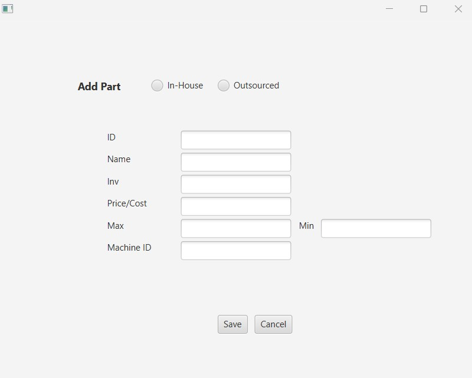
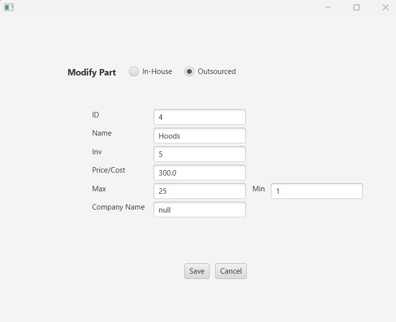
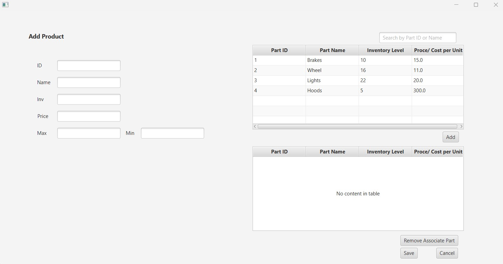
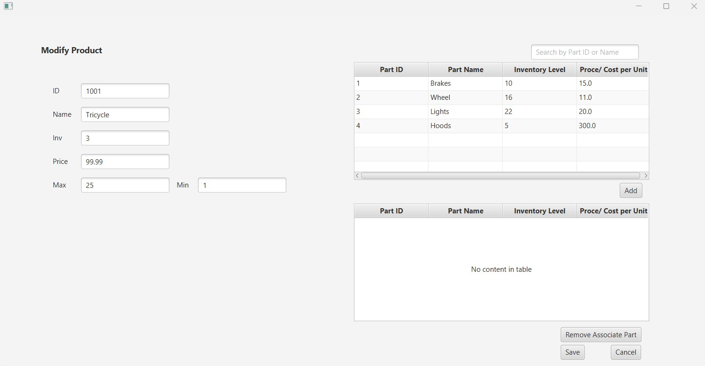

# IMS Application- version 1.0

## Purpose of application:
- Provides a GUI for adding, deleting, updating, and viewing inventory

--------------------------------------------------------------------------------------------------------------------

## Application Specifications:

- IDE Product Version: JetBrains Intellij
- JDK Version: Java SE 17.0.4
- JavaFX Version: JavaFX-SDK-17.0.1

--------------------------------------------------------------------------------------------------------------------

# Inventory Management Screen:
- Once the application is launched, the user will be presented with the Inventory Management System (IMS) screen. It will be preloaded with a few parts and products.

## Add Part: 
- User can select the "Add" button in the Parts table to be directed to the "Add Part" screen.

## Modify Part:
- User can select the "Modify" button in the Parts table to be directed to the "Modify Part" screen.

## Add Product:
- User can select the "Add" button in the Products table to be directed to the "Add Product" screen.
- The user will have to associate parts with their new product.

## Modify Product:
- User can select the "Modify" button in the Products table to be directed to the "Modify Product" screen.
- This can be used to add or remove parts from the product or 

